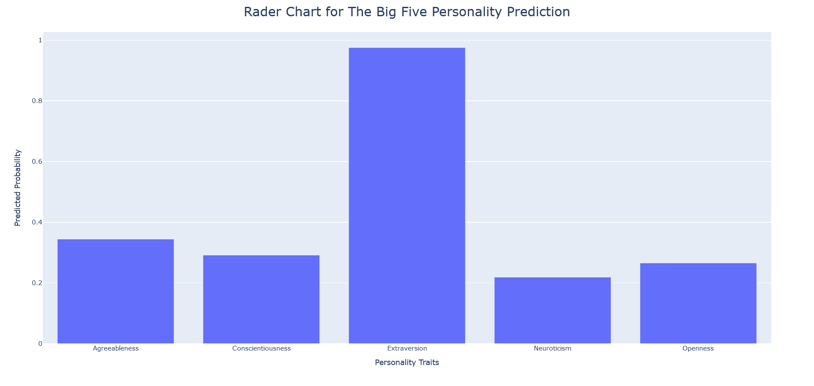
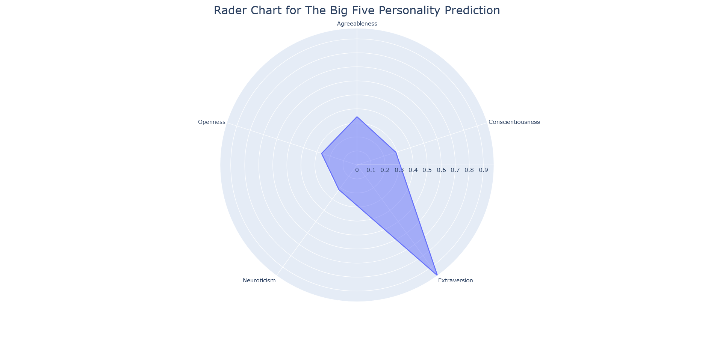

# The-Big-Five-Personality-Traits-Prediction-Based-on-Instagram-Text-Data

# Overview
 This project consists of two components. The first component is a data pipeline using `instaloader` to fetch data of Instagram users and posts of them. After that, the data fetched will be stored into a sqlite database. The second component is the big five personality traits prediction based on the Instagram data fetched. The data utilzes the combination of the bio of the Instagram user and the caption of 10 posts of them. It is to call the `Nasserelsaman/microsoft-finetuned-personality` model from Huggingface by access token. And it will output a dictionary of the predicted probabiltiy of each personality traits. There are two visualization options for user to visualize the prediction results. One is bar chart and another is rader chart.

# The Big Five Personality Traits 
[Big Five personality traits](https://en.wikipedia.org/wiki/Big_Five_personality_traits) also known as Five Factor model of Personality or OCEAN model proposes that there are five broad dimensions of personality:
   * **O**penness: 
     * the degree to which a person is open to new experiences
     * inventive/curious vs. consistent/cautious
   * **C**onscientiousness:
     * the degree to which a person have self-discipline and control
     * efficient/organized vs. extravagant/careless
   * **E**xtraversion:
     * the degree to which a person is sociable
     * outgoing/energetic vs. solitary/reserved
   * **A**greeableness:
     * the degree to which a person is willing to treat people kind
     * friendly/compassionate vs. critical/judgmental
   * **N**euroticism:
     * the degree to which a person is emotional unstable
     * sensitive/nervous vs. resilient/confident

# Features
1. Data Collection with `Instaloader`:
   * Fetches Instagram user profiles and their 10 most recent posts.
   * Stores data in an `SQLite` database for efficient retrieval.

2. Personality Prediction Model:
   * Utilizes the pre-trained `Nasserelsaman/microsoft-finetuned-personality` model from Huggingface.
   * Processes user bios and captions to predict personality traits.
   * Converts raw logits to probabilities using a sigmoid function.

3. Visualization Options:
   * Offers two visualization methods:
     * Bar Chart: Compares predicted probabilities for each trait.
     * Radar (Spider) Chart: Provides a holistic view of trait relationships.

# Getting Started
1. Installation:
    * Clone this repository to your local machine.
    * Install required Python packages (`pip install -r requirements.txt`).
    * 
2. Setting Up Instagram Credentials:
    * Create a new Instagram account (this account is likely to get banned once you cross the data fetching limit).
    * Create an access token in Huggingface for you to get access to `Nasserelsaman/microsoft-finetuned-personality` 

3. Running the Application:
    * Execute `main.py`.
    * Choose from the menu options:
        * Put your Huggingface access token in `.env` file
        * Fetch Instagram data (login and data insertion).
        * Print stored usernames.
        * Perform personality prediction.
        * Exit the program.

# Usage
1. Fetch Instagram Data:
   * Log in with your Instagram credentials.
   * Enter the target Instagram username (e.g., taylorswift, avrillavigne, adele).
   * Data will be fetched and stored in the SQLite database.

2. Personality Prediction:
   * Enter the target Instagram username again.
   * If the user exists in the database, personality traits will be predicted.
   * Choose between bar chart or radar chart visualization.

3. Visualizations:
   * Bar Chart: Compare probabilities for each trait.
   * Radar Chart: Understand trait relationships.

# Personality Prediction Visualization Preview
* Bar Chart

* Rader Chart

# Dependencies
* Python 3.7+
* instaloader 4.13.1
* pandas 2.2.2
* plotly 5.24.0
* numpy 1.26.4
* torch 2.0.1
* transformers 4.44.2

# Acknowledgments
* The `Nasserelsaman/microsoft-finetuned-personality` model from Huggingface.
* `Instaloader` for Instagram data extraction.
